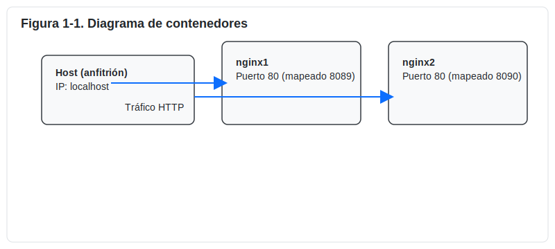
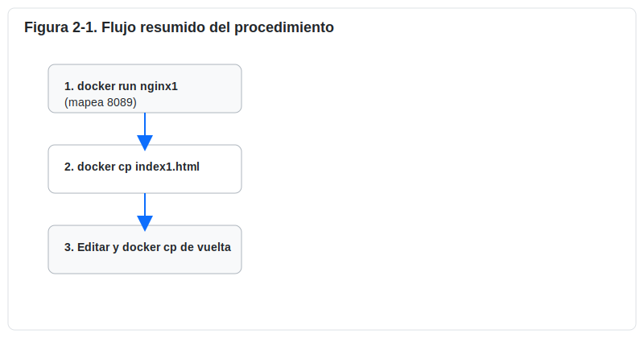

## 1. Título

Práctica No 2 — Contenedores servidor web

## 2. Tiempo de duración

45 minutos

## 3. Fundamentos

Los contenedores son una tecnología de virtualización a nivel de sistema operativo que permite empaquetar una aplicación y sus dependencias en una unidad aislada y reproducible. Docker es la plataforma más popular para crear, distribuir y ejecutar contenedores. A diferencia de las máquinas virtuales tradicionales, los contenedores comparten el kernel del sistema operativo del anfitrión, lo que reduce el uso de recursos y acelera el inicio de servicios.

En esta práctica se utiliza la imagen oficial de Nginx —un servidor web de alto rendimiento y muy utilizado— para levantar dos instancias independientes. Cada contenedor ejecuta Nginx con su propio sistema de archivos virtualizado; sin embargo, es posible intercambiar o persistir archivos (como `index.html`) entre el host y el contenedor mediante el comando `docker cp` o montando volúmenes. Editar el `index.html` dentro del contenedor permite personalizar la página que Nginx sirve en el puerto 80 del contenedor; al mapear puertos del host (por ejemplo 8089 → 80), podemos acceder a cada servicio desde el navegador del host.

Los conceptos clave a entender incluyen:

- Imágenes vs contenedores: la imagen es la plantilla inmutable; el contenedor es la instancia en ejecución.
- Mapeo de puertos: el host puede exponer puertos locales que reenvían tráfico al puerto interno del contenedor.
- Persistencia de datos: los cambios dentro de un contenedor no son persistentes por defecto; para conservarlos conviene usar volúmenes o construir una imagen personalizada.

Además, la práctica explora flujos comunes de trabajo: crear contenedores con `docker run`, copiar archivos con `docker cp` y verificar el servicio desde un navegador. A continuación se incluyen figuras que ayudan a visualizar la arquitectura y el procedimiento.

<p align="center"></p>

El manejo de páginas web estáticas (HTML) en Nginx es sencillo: Nginx sirve archivos desde `/usr/share/nginx/html` por defecto. Modificando `index.html` cambiamos el contenido visible sin tocar la configuración principal del servidor.

Más ventajas de usar contenedores para este tipo de prácticas: reproducibilidad, portabilidad entre máquinas y facilidad para crear entornos independientes para pruebas.

<p align="center"></p>

## 4. Conocimientos previos

Para realizar esta práctica el estudiante necesita tener claros los siguientes temas:

- Comandos básicos de Docker (run, ps, rm, cp, logs).
- Manejo básico de editores de texto en terminal (nano, vi/vim).
- Uso de un navegador web para verificar servicios locales.
- Fundamentos básicos de HTTP y puertos de red (qué es el puerto 80, mapeo de puertos).
- Conceptos elementales sobre archivos del servidor web (ubicación de `index.html` en Nginx).

## 5. Objetivos a alcanzar

- Implementar dos contenedores con Nginx y exponerlos en puertos distintos del host.
- Manipular y reemplazar archivos `index.html` dentro de cada contenedor para personalizar el contenido.
- Verificar el funcionamiento mediante el acceso HTTP desde el navegador.
- Explorar formas de persistencia (volúmenes) y creación de imágenes personalizadas.

## 6. Equipo necesario

- Computador con sistema operativo: Windows, Linux o macOS.
- Docker instalado y en ejecución (por ejemplo, Docker Desktop o Docker Engine en Linux).
- Recomendado: 4 GB de RAM libre y al menos 2 CPU disponibles para ejecutar contenedores de forma fluida.
- Cuenta en Docker Hub si se desea subir imágenes personalizadas (opcional).
- Versión de Docker usada durante la práctica: Docker Engine 24.x (indicar la versión concreta con `docker --version`).

## 7. Material de apoyo

- Documentación oficial de Docker: https://docs.docker.com/
- Documentación oficial de Nginx: https://nginx.org/
- Guía de la asignatura y apuntes del curso (proveídos por el docente).
- Cheat sheet de comandos Linux y Docker (resumen rápido de comandos).

## 8. Procedimiento (paso a paso)

Figura 2-1. Flujo resumido del procedimiento (ver imagen)

1. Paso 1 — Crear el contenedor institucional (`nginx1`) y mapear el puerto 8089:

	- Comando:

	```sh
	docker run -d --name nginx1 -p 8089:80 nginx
	```

	Figura 8-1. Creación de `nginx1` (contenedor institucional)

2. Paso 2 — Crear el contenedor personal (`nginx2`) y mapear el puerto 8090:

	- Comando:

	```sh
	docker run -d --name nginx2 -p 8090:80 nginx
	```

	Figura 8-2. Creación de `nginx2` (contenedor personal)

3. Paso 3 — Obtener el archivo `index.html` desde `nginx1` al host:

	- Comando:

	```sh
	docker cp nginx1:/usr/share/nginx/html/index.html ./index1.html
	```

	Figura 8-3. Copiar `index.html` desde `nginx1` al host

4. Paso 4 — Editar `index1.html` en el host con la información institucional (usar `nano` o `vi`). Guardar cambios.

	Figura 8-4. Edición del archivo `index1.html`

5. Paso 5 — Copiar el archivo editado de vuelta al contenedor `nginx1`:

	- Comando:

	```sh
	docker cp index1.html nginx1:/usr/share/nginx/html/index.html
	```

	Figura 8-5. Copiar `index1.html` al contenedor

6. Paso 6 — Repetir los pasos 3-5 para `nginx2` usando `index2.html` y la información personal del estudiante (nombre: Josue Antonio Romero Ramon, 4.º ciclo, Titulación — Desarrollo de Software).

7. Paso 7 — Verificar en el navegador las siguientes direcciones:

	- Institucional: http://localhost:8089
	- Personal: http://localhost:8090

	Figura 8-6. Verificación en navegador

## 9. Resultados esperados

- El contenedor `nginx1` sirviendo una página con la información institucional (Tecnológico Sudamericano, Tendencias Tecnológicas, Desarrollo de Software — 4.º ciclo) accesible en http://localhost:8089.
- El contenedor `nginx2` sirviendo una página con la información personal del estudiante (Josue Antonio Romero Ramon, 4.º ciclo, Titulación — Desarrollo de Software) accesible en http://localhost:8090.

Ejemplo de verificación: captura de pantalla del navegador mostrando la página institucional (inserte aquí la captura en su entrega). Las figuras deben tener un ancho máximo de 800px.

## 10. Bibliografía

Docker, Inc. (2023). Docker Documentation. https://docs.docker.com/

NGINX, Inc. (2021). NGINX Documentation. https://nginx.org/


